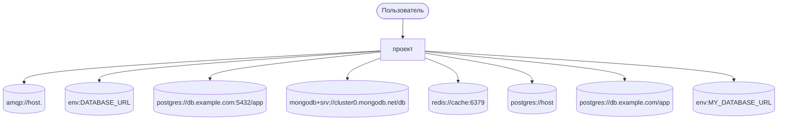
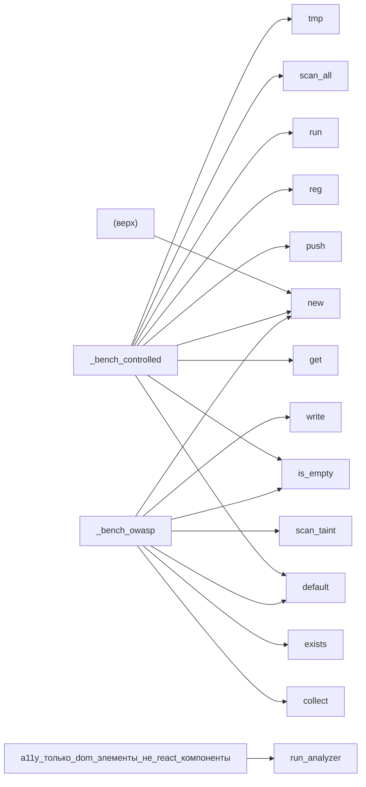

<!-- co:auto:start c4 -->
## C4-модель (из кода — обновляется автоматически)

### Уровень 1 — Контекст

```mermaid
flowchart TD
  user(["Пользователь"])
  ______["проект"]
  user --> ______
  ______ --> ext0[("amqp://host.")]
  ______ --> ext1[("env:DATABASE_URL")]
  ______ --> ext2[("postgres://db.example.com:5432/app\n")]
  ______ --> ext3[("mongodb+srv://cluster0.mongodb.net/db\n")]
  ______ --> ext4[("redis://cache:6379\n")]
  ______ --> ext5[("postgres://host")]
  ______ --> ext6[("postgres://db.example.com/app\n")]
  ______ --> ext7[("env:MY_DATABASE_URL")]
```

### Уровень 2 — Контейнеры

```mermaid
flowchart TD
  crates_ailc_capabilities_src["crates/ailc-capabilities/src<br/>798 опр."]
  crates_ailc_core_src_engines["crates/ailc-core/src/engines<br/>470 опр."]
  crates_ailc_core_src["crates/ailc-core/src<br/>221 опр."]
  crates_ailc_capabilities_tests["crates/ailc-capabilities/tests<br/>60 опр."]
  crates_ailc_core_tests["crates/ailc-core/tests<br/>60 опр."]
  crates_ailc_contracts_src["crates/ailc-contracts/src<br/>56 опр."]
  crates_ailc_src["crates/ailc/src<br/>51 опр."]
  crates_ailc_examples["crates/ailc/examples<br/>16 опр."]
```

### Уровень 3 — Компоненты (вызовы)

```mermaid
flowchart LR
  ______["(верх)"] --> new["new"]
  _bench_controlled["_bench_controlled"] --> default["default"]
  _bench_controlled["_bench_controlled"] --> get["get"]
  _bench_controlled["_bench_controlled"] --> is_empty["is_empty"]
  _bench_controlled["_bench_controlled"] --> new["new"]
  _bench_controlled["_bench_controlled"] --> push["push"]
  _bench_controlled["_bench_controlled"] --> reg["reg"]
  _bench_controlled["_bench_controlled"] --> run["run"]
  _bench_controlled["_bench_controlled"] --> scan_all["scan_all"]
  _bench_controlled["_bench_controlled"] --> tmp["tmp"]
  _bench_owasp["_bench_owasp"] --> collect["collect"]
  _bench_owasp["_bench_owasp"] --> default["default"]
  _bench_owasp["_bench_owasp"] --> exists["exists"]
  _bench_owasp["_bench_owasp"] --> is_empty["is_empty"]
  _bench_owasp["_bench_owasp"] --> new["new"]
  _bench_owasp["_bench_owasp"] --> scan_taint["scan_taint"]
  _bench_owasp["_bench_owasp"] --> write["write"]
  a11y________dom_____________react___________["a11y_только_dom_элементы_не_react_компоненты"] --> run_analyzer["run_analyzer"]
```
<!-- co:auto:end -->
