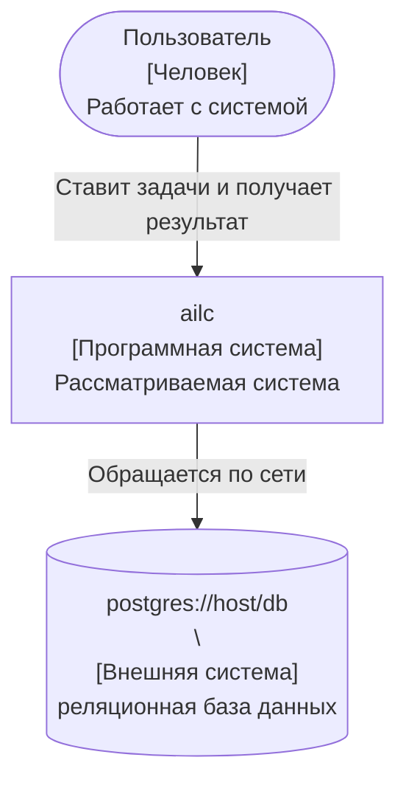
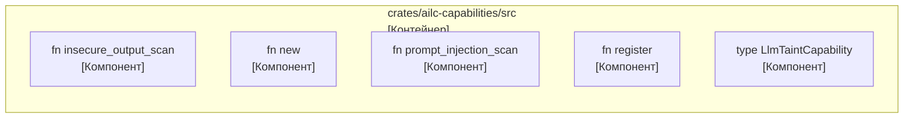
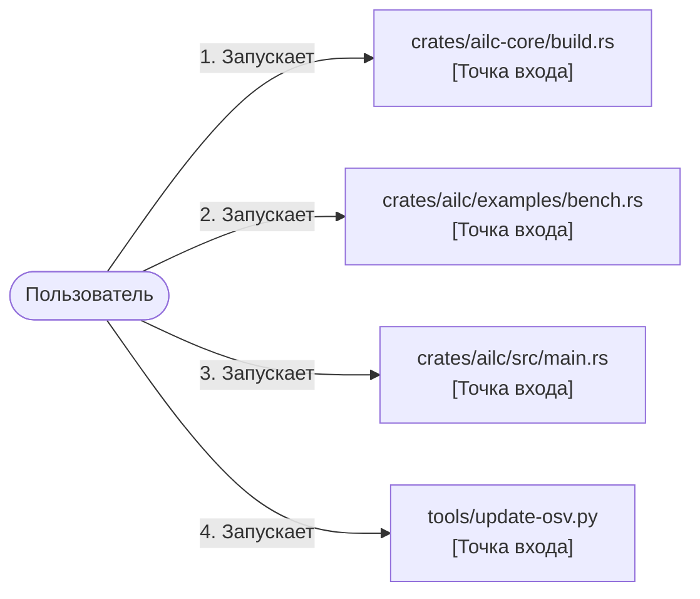

# Архитектурные диаграммы по модели C4

<!-- ЭТОТ ДОКУМЕНТ СОБИРАЕТСЯ АВТОМАТИЧЕСКИ. Правки вносите ответами на
     вопросы (spec/answer) либо в зонах свободной прозы ailc:free. Всё
     остальное будет перезаписано при следующей сборке. -->

| Реквизит | Значение |
|---|---|
| Наименование изделия | ailc |
| Версия изделия | 0.7.2 |
| Обозначение документа | АРХ C4 |
| Наименование документа | Архитектурные диаграммы по модели C4 |
| Документ построен по | Модель C4 (Simon Brown) |
| Полнота по стандарту | 100 процентов (3 из 3 обязательных разделов) |
| Условия использования | Apache-2.0 |

## Содержание

- 0 Легенда (обязательный)
- 1 Диаграмма контекста системы (обязательный)
- 2 Диаграмма контейнеров (обязательный)
- 3 Диаграмма компонентов (при необходимости)
- 4 Диаграмма кода (при необходимости)
- 5 Динамическая диаграмма (при необходимости)
- 6 Диаграмма развертывания (при необходимости)
- 7 Диаграмма ландшафта систем (при необходимости)

## 0 Легенда

Обозначения на диаграммах. Прямоугольник со скруглением обозначает человека или внешнюю роль; прямоугольник обозначает программную систему, контейнер или компонент; цилиндр обозначает хранилище данных. Тип элемента и применяемая технология указаны в подписи самого элемента. Каждая линия обозначает однонаправленную связь и подписана назначением связи, а для связи между контейнерами дополнительно указан протокол взаимодействия.
<!-- ailc:free:start c4.легенда -->
<!-- ailc:free:end -->

## 1 Диаграмма контекста системы

**Диаграмма контекста системы для «ailc»**


<!-- ailc:free:start c4.контекст -->
<!-- ailc:free:end -->

## 2 Диаграмма контейнеров

**Диаграмма контейнеров для «ailc»**

```mermaid
flowchart TD
  к0["crates/ailc-capabilities/src<br/>[Контейнер: rust]<br/>Определений 1004, доступно извне 180"]
  к1["crates/ailc-core/src/engines<br/>[Контейнер: rust]<br/>Определений 705, доступно извне 124"]
  к2["crates/ailc-core/src<br/>[Контейнер: rust]<br/>Определений 492, доступно извне 133"]
  к3["crates/ailc/src<br/>[Контейнер: rust]<br/>Определений 123, доступно извне 9"]
  к4["crates/ailc-contracts/src<br/>[Контейнер: rust]<br/>Определений 57, доступно извне 38"]
  к5["crates/ailc-core/src/standards<br/>[Контейнер: rust]<br/>Определений 29, доступно извне 20"]
  к6["crates/ailc/examples<br/>[Контейнер: rust]<br/>Определений 16, доступно извне 0"]
  к7["crates/ailc-testkit/src<br/>[Контейнер: rust]<br/>Определений 10, доступно извне 5"]
  к8["npm/ailc-mcp/bin<br/>[Контейнер: javascript]<br/>Определений 8, доступно извне 0"]
  к9["tools<br/>[Контейнер: python]<br/>Определений 7, доступно извне 7"]
  к10["crates/ailc-core<br/>[Контейнер: rust]<br/>Определений 1, доступно извне 0"]
```


<!-- ailc:free:start c4.контейнеры -->
<!-- ailc:free:end -->

## 3 Диаграмма компонентов

**Диаграмма компонентов наиболее крупного контейнера системы «ailc»**


<!-- ailc:free:start c4.компоненты -->
<!-- ailc:free:end -->

## 4 Диаграмма кода

- **crates/ailc-capabilities/src**: определений 1004, из них доступных извне 180. Среди них: fn insecure_output_scan, fn new, fn prompt_injection_scan, fn register, type LlmTaintCapability
- **crates/ailc-contracts/src**: определений 57, из них доступных извне 38. Среди них: type GatePolicy, type GateReport, type PolicyPack, type RunInput, type Thresholds
- **crates/ailc-core**: определений 1, из них доступных извне 0
- **crates/ailc-core/src**: определений 492, из них доступных извне 133. Среди них: fn get, fn run, fn set, fn today, type AgentOrchestrator
- **crates/ailc-core/src/engines**: определений 705, из них доступных извне 124. Среди них: fn extract, fn extract, fn is_empty, type ApiDoc, type ApiItem
- **crates/ailc-core/src/standards**: определений 29, из них доступных извне 20. Среди них: fn complete, fn completeness, fn draft_text, fn is_required, fn percent
- **crates/ailc-testkit/src**: определений 10, из них доступных извне 5. Среди них: fn ctx, fn new, fn path, fn write, type TempTree
- **crates/ailc/examples**: определений 16, из них доступных извне 0
- **crates/ailc/src**: определений 123, из них доступных извне 9. Среди них: fn install, fn run, fn run, fn run_once, fn uninstall
- **npm/ailc-mcp/bin**: определений 8, из них доступных извне 0
- **tools**: определений 7, из них доступных извне 7. Среди них: fn compact, fn main, fn preferred_id, fn ranges_of, fn severity_of
<!-- ailc:free:start c4.код -->
<!-- ailc:free:end -->

## 5 Динамическая диаграмма

**Динамическая диаграмма запуска системы «ailc»**


<!-- ailc:free:start c4.динамика -->
<!-- ailc:free:end -->

## 6 Диаграмма развертывания

**Диаграмма развертывания системы «ailc»**

```mermaid
flowchart TD
  %% описаний развёртывания в проекте не обнаружено
```
<!-- ailc:free:start c4.развёртывание -->
<!-- ailc:free:end -->

## 7 Диаграмма ландшафта систем

Внешние сервисы, от которых зависит работа системы:
- `postgres://host/db\n\` (crates/ailc-core/src/engines/cli.rs:884)
<!-- ailc:free:start c4.ландшафт -->
<!-- ailc:free:end -->

## Лист регистрации изменений

| Изменение | Дата | Класс | Затронуто файлов | Основание |
|---|---|---|---|---|
| 1 | 2026-07-28 | слом публичного контракта | 228 | main |

## Отметка о полноте

Все обязательные разделы документа закрыты: 3 из 3. Документ соответствует требованиям к составу разделов, установленным стандартом Модель C4 (Simon Brown).
