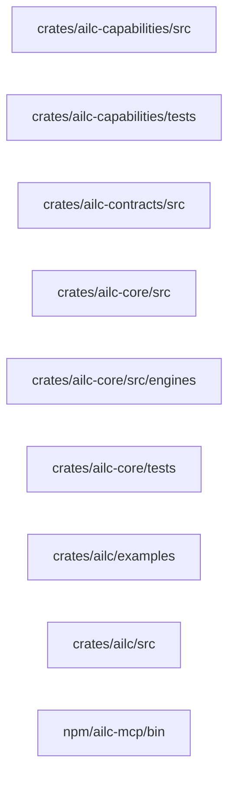

<!-- co:auto:start deps -->

```mermaid
graph LR
  m0["crates/ailc-capabilities/src"]
  m1["crates/ailc-capabilities/tests"]
  m2["crates/ailc-contracts/src"]
  m3["crates/ailc-core/src"]
  m4["crates/ailc-core/src/engines"]
  m5["crates/ailc-core/tests"]
  m6["crates/ailc/examples"]
  m7["crates/ailc/src"]
  m8["npm/ailc-mcp/bin"]
```
<!-- co:auto:end -->
